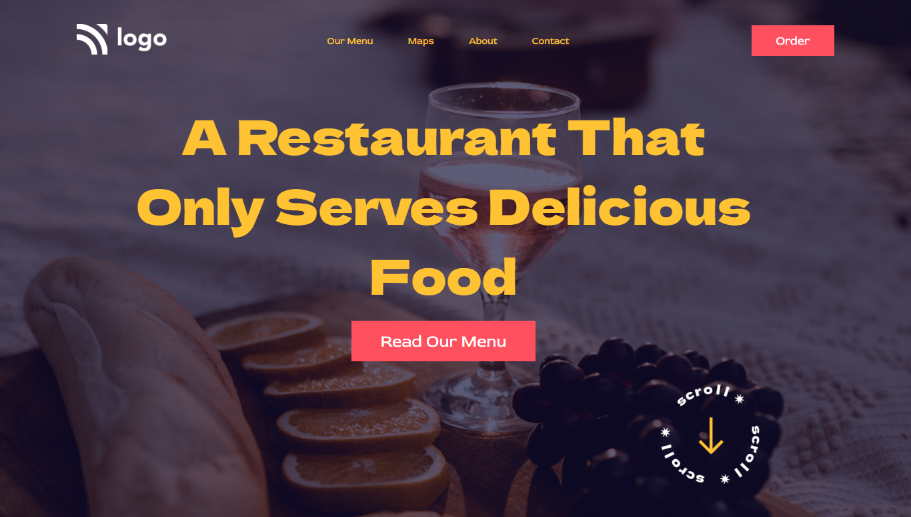

# Project 2

 I am [Nikhil](https://github.com/nikhilbhosale999)

While working on this project I learn about - 
-  The basic HTMl and CSS Positions 

### Time Taken - 1hr

## For Live Website Link - [Click here](https://codecolt-project2.netlify.app)

### Where I learn this -
The course Link - [Click here](https://ineuron.ai/course/Full-Stack-Javascript-Web-Developer)

